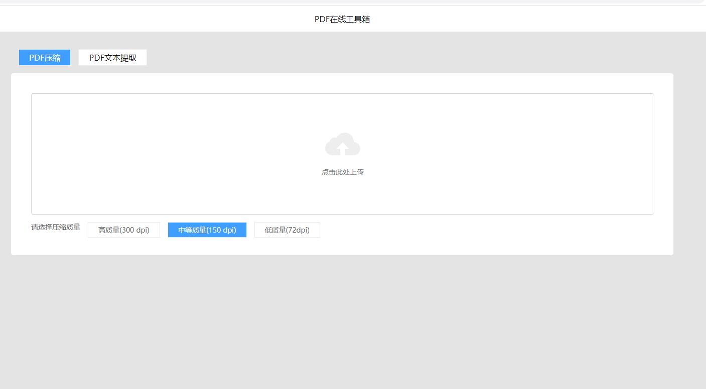
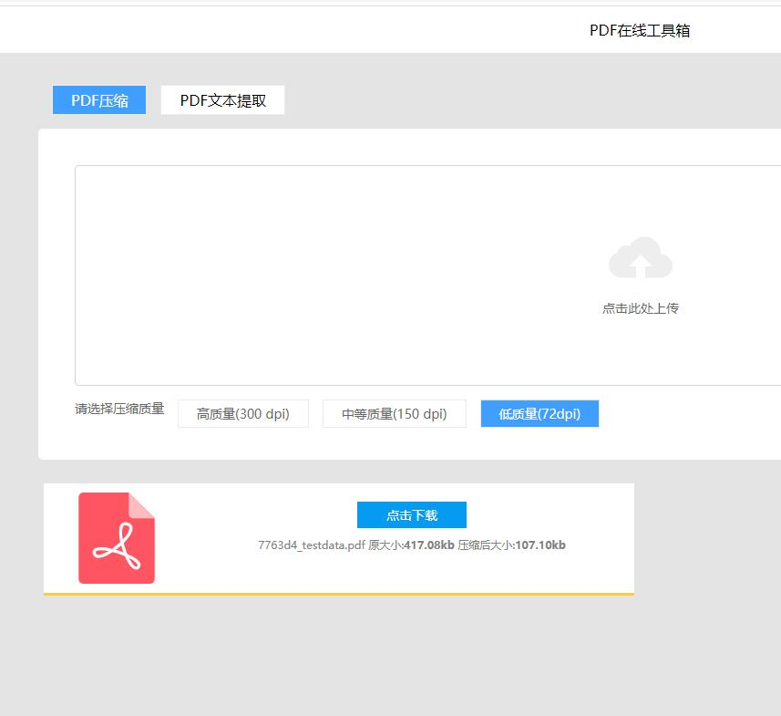
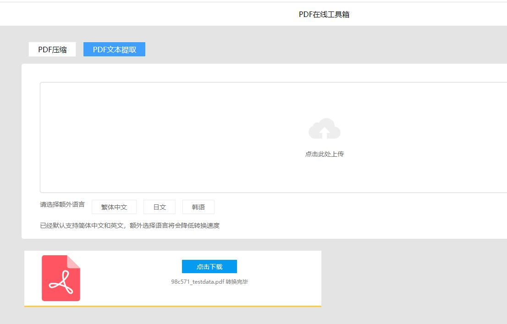
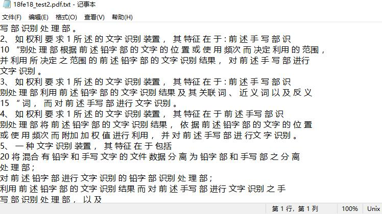

[](https://github.com/lixiaofei123/pdftoolbox/actions/workflows/docker.yml)

## 一个简单的在线pdf工具箱

本项目基于[GhostScript](https://www.ghostscript.com)进行开发,目前支持PDF压缩以及PDF文字提取(OCR)

PDF文字提取目前支持的语言有 英文、简体中文、繁体中文、日文、韩文

## 使用方法

### 使用Docker部署

建议使用Docker一键部署

安装步骤

```
mkdir -p /data/pdftoolbox/input
mkdir -p /data/pdftoolbox/output
docker run -d --name pdftoolbox --restart=always -p 8082:8082 -v /data/pdftoolbox/input:/opt/pdftoolbox/input  -v /data/pdftoolbox/output:/opt/pdftoolbox/output  mrlee326/pdftoolbox
```

启动成功后，在浏览器中访问 http://ip:8082，如下图所示




选择上方的【pdf压缩】，然后点击【点击此处上传】按钮，选择要转换的文件，即可上传并压缩。目前支持三种压缩质量
 - 高质量 (300dpi)
 - 中质量 (150dpi)
 - 低质量 (72dpi)

如下图所示



选择上方的【pdf压缩】，然后点击【点击此处上传】按钮，选择要转换的文件，即可上传并进行OCR文字提取。目前导出格式为txt。此过程会比较慢，请耐心等待。等待完毕后即可下载。



识别结果如下图所示：



### 在Linux上部署

请参考Dockerfile文件


